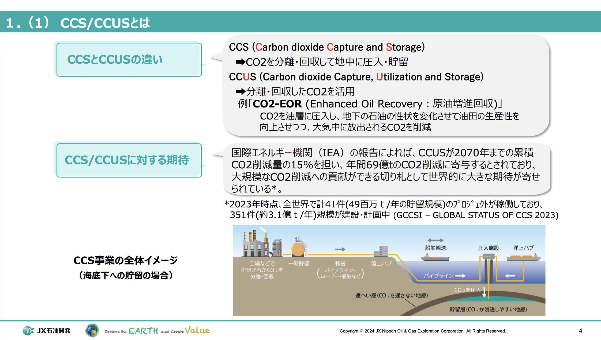
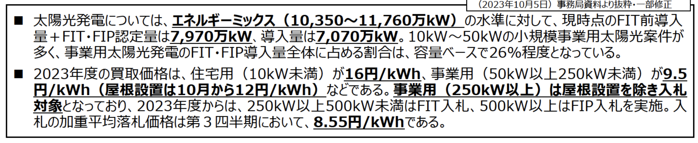
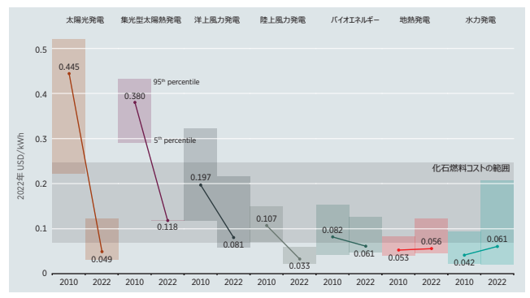
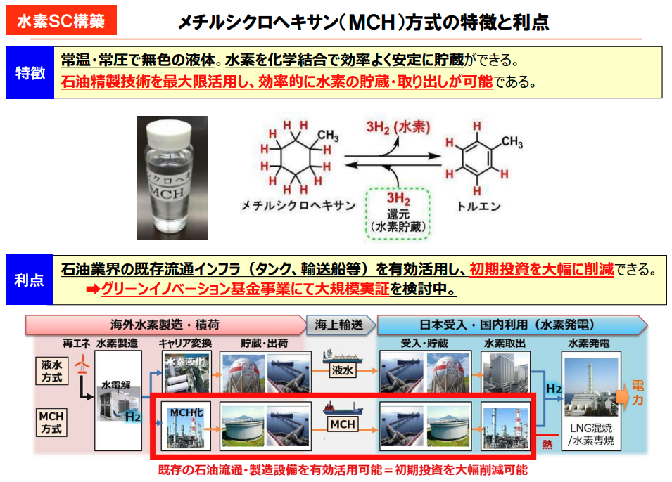
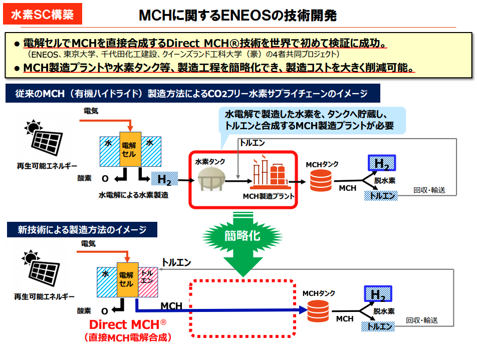
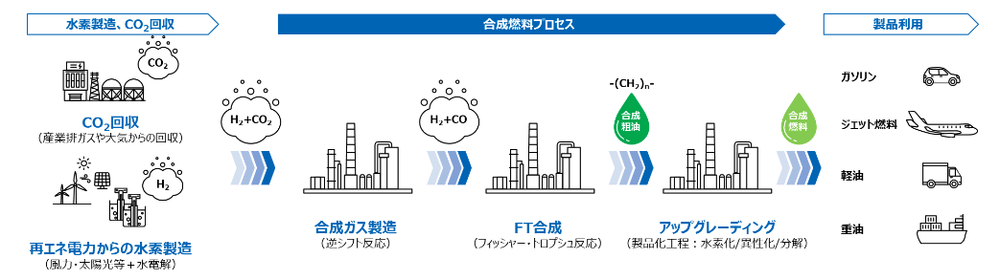

# エネルギートランジション

### カーボンニュートラル
* 温室効果ガスの「排出量」から、植林、森林管理などによる「吸収量」をさしひいいて、合計を実質的にゼロにすること

### 日本の抱えるエネルギー課題
* 日本は化石燃料も含めて資源が乏しいことでエネルギーの確保を苦労してきた
* エネルギーをどのように安定的に届けるかが非常に重要
* 気候変動に対応というのも新しいテーマとして重要度が上がっていてその1つがカーボンニュートラル
* 世界の平均気温が上がっている（0.8~1.3℃）ので温室効果ガスを下げていくのがとても大切
* 2015年に「パリ協定」が採択  
パリ協定・・・世界の平均気温の上昇を産業革命以前と比べて2℃未満に抑えることを目指し、さらに1.5℃に向けて努力する
* 日本は2050年カーボンニュートラルを宣言  
2030年までに46%削減（2013年度対比）、CO2の排出量を実質0にするのが2050年

### 温室効果ガスの排出量を削減する3つの方法
1. 温室効果ガスの排出抑制（排出そのものを減らす）  
製造・事業の効率化。（省エネ・燃料切り替え・再エネ活用など）
2. CO2の人為的固定化（人為的に新たにCO2を回収し、長期に渡り固定化）  
CO2の回収・貯留。

3. CO2の自然吸収増加  
森林吸収（植林・森林管理など）

### 日本における再生可能エネルギー
再生可能エネルギーは主に「風力」と「太陽光」。（バイオマスや地熱もある）
* 風力  
緯度が高い地域では風力発電には適地が多い  
→ ヨーロッパや南米は風力発電に適している

上記の理由をchatGPTに聞きました。
```
1. 偏西風（ジェット気流）の影響
高緯度地域では、地球の自転と温度差によって強力な偏西風（西から東に吹く風）が安定的に発生します。
偏西風は年間を通じて吹くため、風力発電に必要な安定した風資源が得られます。

2. 低気圧が多く発生する
高緯度地域は、寒冷な極地の空気と温暖な中緯度の空気が衝突し、低気圧が頻発します。
低気圧が通過する際、風速が上がり、発電に有利な強風が発生します。

3. 地形の影響が少ない（平原・海沿い）
ヨーロッパ北部やカナダのような高緯度地域には、山地よりも平原や沿岸地域が多く、風の流れを遮る障害物が少ないため、風速が落ちにくいです。
特に沿岸部では、海風も発生するため、風の安定性がさらに向上します。
```

* 太陽光  
緯度が低い地域では太陽光発電には適地が多い  
→ オーストラリアやアフリカ・中東は太陽光発電に適している

上記の理由をchatGPTに聞きました。
```
1. 日射量が多い
赤道付近では年間を通じて太陽の高度が高く、日射角度が垂直に近いため、1平方メートルあたりの受光エネルギーが大きくなります。
緯度が低いほど、昼間の時間が安定して長く、年間を通して日照時間の変動も少ないです。

2. 晴天率が高い地域が多い
サハラ砂漠、アラビア半島、オーストラリアの内陸など、低緯度地域には乾燥帯が広がり、雨が少なく晴天が多いです。
晴れの日が多いことで、年間を通じて安定した太陽光を利用できます。

3. 気温による影響が小さい
太陽光パネルの発電効率は高温だと若干低下しますが、発電量への影響は限定的です。低緯度地域の豊富な日射量でその効率低下を十分に補えます。

4. 季節変動が少ない
赤道付近では四季による日照量の変動が少ないため、年間を通じて安定した発電が可能です。
一方で高緯度地域では、冬の太陽高度が低く、日照時間が極端に短くなるため、太陽光発電には不利になります。

5. 利用可能な広い土地の確保
低緯度地域には広大な未開発の土地（砂漠など）が多く、大規模な太陽光発電設備の設置に適しています。
```

日本は
* 平均風速が低い
* 台風などの通過が多く、風車が損傷するリスクがある
* 地形が複雑
* 日射量
* 四季がある
* 天候の不安定さ（曇り、雨、雪）

から「風力」「太陽光」の発電効率が悪い。よって発電コストが高くなってしまう。

### 再エネのコスト

下記画像は日本の太陽光発電コスト。


下記画像は各再エネの発電コストと化石燃料コストの比較。


2022年には **「海外の適地では」** 太陽光発電効率が化石燃料コストを下回っている。（日本円で6.3円）  
この電力を日本に持ってくることができればグリーンな電力を日本で使うことができる。  
海外の再エネから持ってくるのは実証レベルなのでまだ一般には流通していない。

### どのように持ってくる？ ⇨ 水素キャリア  
海外の適地の場合電気が安い。  
→ 安い電気と水の電気分解で安い水素を作れる。  
→ 安い水素を日本に持ってくる。  
→ 安い水素を燃やして安い電気が手に入る。




* MCHとトルエンは液体なので、既存の石油タンカーで持ち運べる。（新規でインフラがいらない。）
* トルエン自体は無くならないのでこのチェーンの中を回り続けることになる。
* 実用化は2030年ぐらい？
* トルエンとMCHの変換にコストがかかっているらしい
* この話のポイントは水を分解するときの電力が再エネ（グリーン）か化石燃料を使った電力（グリーンでない）か

### 合成燃料
* CO2とグリーンな水素からガゾリンやジェット燃料を作る仕組み
